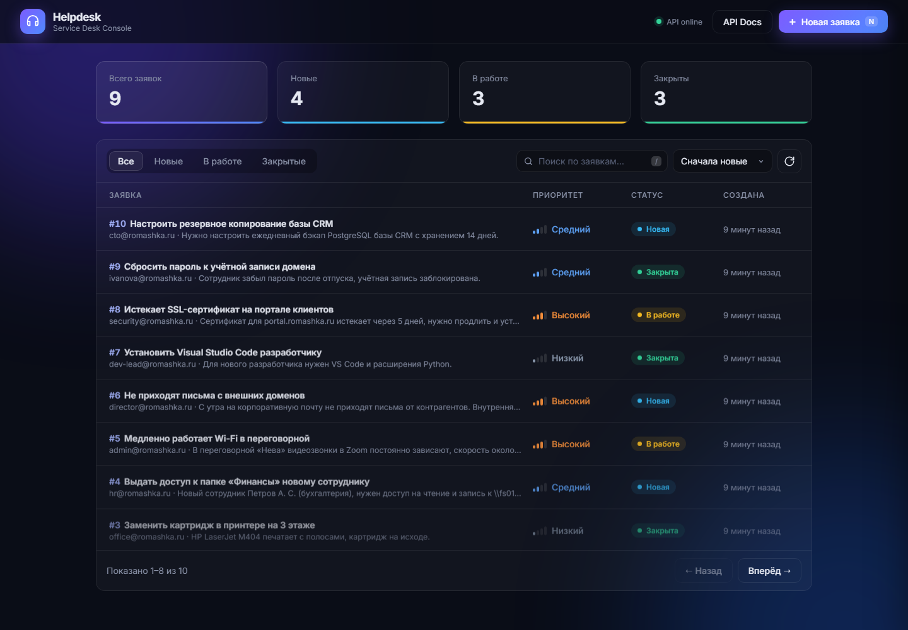

# Helpdesk API

[](https://github.com/ReZoKes/helpdesk-api/actions/workflows/ci.yml)


Асинхронный микросервис управления инцидентами техподдержки.

**Стек:** FastAPI, SQLAlchemy 2.0 (async) + asyncpg, PostgreSQL, Alembic,
Pydantic v2, pytest, Docker Compose, Vanilla JS.



## Возможности

- CRUD заявок с фильтрацией по статусу, поиском, сортировкой и пагинацией.
- Правила смены статусов: `new → in_progress → closed`, переоткрытие
  закрытой заявки; недопустимый переход возвращает `409 Conflict`.
- История изменений (аудит) в отдельной таблице `ticket_events`.
- Фоновая отправка email-уведомления при смене статуса (`BackgroundTasks`).
- Статистика по статусам, healthcheck с проверкой БД.
- Админка: фильтры, карточка заявки с историей, создание заявки.

## Запуск в Docker

```bash
docker compose up --build
```

- Админка: http://localhost:8000
- Swagger: http://localhost:8000/docs
- Healthcheck: http://localhost:8000/health

Миграции применяются автоматически при старте контейнера.

## Локальный запуск

```bash
python -m venv .venv
.venv\Scripts\activate          # Linux/macOS: source .venv/bin/activate
pip install -r requirements-dev.txt
copy .env.example .env          # Linux/macOS: cp .env.example .env
docker compose up -d db
alembic upgrade head
python -m scripts.seed          # демо-данные (необязательно)
uvicorn app.main:app --reload
```

## Тесты и линтер

```bash
pytest
ruff check .
```

Тесты создают отдельную базу `<POSTGRES_DB>_test` и очищают её после
каждого теста. Отправка email в тестах подменяется моком.

CI (GitHub Actions) на каждый push запускает линтер, миграции
(применение, сверку с моделями, откат), тесты и smoke-тест
`docker compose`.

## API

| Метод  | Путь                           | Описание                              |
|--------|--------------------------------|---------------------------------------|
| POST   | `/api/v1/tickets`              | Создать заявку                        |
| GET    | `/api/v1/tickets`              | Список (`status`, `search`, `sort`, `limit`, `offset`) |
| GET    | `/api/v1/tickets/stats`        | Количество заявок по статусам         |
| GET    | `/api/v1/tickets/{id}`         | Получить заявку                       |
| GET    | `/api/v1/tickets/{id}/events`  | История изменений статуса             |
| PATCH  | `/api/v1/tickets/{id}/status`  | Сменить статус + email в фоне         |
| DELETE | `/api/v1/tickets/{id}`         | Удалить заявку                        |

## Структура

```
app/
  api/        # HTTP-слой: роутеры, зависимости, обработчики ошибок
  core/       # конфигурация, подключение к БД, логирование
  models/     # ORM-модели и правила смены статусов
  schemas/    # Pydantic-схемы ввода/вывода
  services/   # бизнес-логика, доменные исключения, уведомления
migrations/   # Alembic
scripts/      # демо-данные
static/       # фронтенд-админка
tests/        # pytest
```
